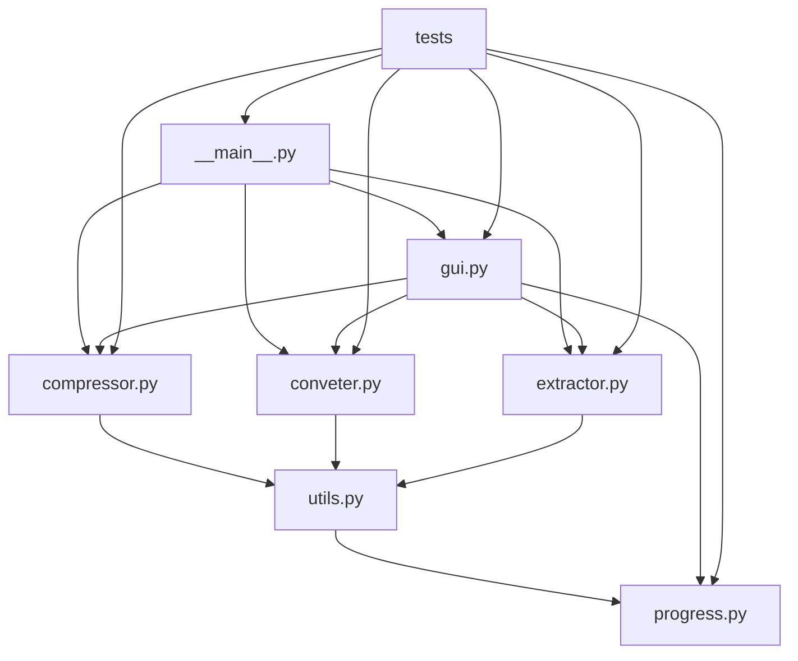

# VideoConverter システムパターン

## アーキテクチャ概要

VideoConverter は、モジュール化されたアーキテクチャを採用しており、各機能が明確に分離されています。主要なコンポーネントは以下の通りです：



## 主要コンポーネント

### 1. コマンドラインインターフェース（`__main__.py`）

- Python の `Fire` ライブラリを使用して、コマンドラインインターフェースを提供
- 各機能（圧縮、変換、抽出、削除）へのエントリーポイントを定義
- `cli_wrapper` デコレータを使用して、進捗表示機能を各コマンドに追加

### 2. 機能モジュール

- **`compressor.py`**: 動画圧縮機能を提供
- **`conveter.py`**: 動画形式変換機能を提供
- **`extractor.py`**: 音声抽出・削除機能を提供

これらのモジュールは、`ffmpeg-python` ライブラリを使用して FFmpeg コマンドを構築し、パイプラインオブジェクトを返します。

### 3. ユーティリティ（`utils.py`）

- `cli_wrapper` デコレータを提供し、進捗表示機能を各コマンドに追加
- 各機能モジュールからのパイプラインを受け取り、`progress.run_with_tcp_pbar` 関数を呼び出して実行

### 4. 進捗表示（`progress.py`）

- FFmpeg の進捗情報を TCP 経由で受信し、プログレスバーを更新
- `tqdm` ライブラリを使用して CLI 用のプログレスバーを表示
- `gevent` を使用して非同期処理を実現

### 5. グラフィカルユーザーインターフェース（`gui.py`）

- `tkinter` ライブラリを使用して GUI を提供
- ファイル選択、変換方法の選択、進捗表示機能を実装
- ビルダーパターンを使用して GUI コンポーネントを構築

### 6. テスト（`tests/`）

- `unittest` フレームワークを使用してテストを実装
- 各機能が正常終了するかどうかを確認するテスト
- GUI の基本機能をテスト

## デザインパターン

VideoConverter では、以下のデザインパターンが使用されています：

### 1. デコレータパターン

`utils.py` の `cli_wrapper` 関数は、デコレータパターンを使用して、各機能関数に進捗表示機能を追加しています。

```python
def cli_wrapper(func: Callable) -> Callable:
    @wraps(func)
    def wrapper(path: str, *args: Any, **kwargs: Any) -> Any:
        pipeline = func(path, *args, **kwargs)
        return progress.run_with_tcp_pbar(path, pipeline)
    return wrapper
```

### 2. オブザーバーパターン

`progress.py` の `FFmpegTCPSender` クラスは、オブザーバーパターンを使用して、FFmpeg の進捗情報を受信し、プログレスバーを更新しています。

```python
class FFmpegTCPSender:
    def __init__(self, pbar: tqdm.tqdm, total: float):
        # Observer pattern
        self.pbar = pbar
        self.total = total
        # ...
```

### 3. ビルダーパターン

`gui.py` の `WindowBuilder` クラスは、ビルダーパターンを使用して、GUI コンポーネントを構築しています。

```python
class WindowBuilder:
    def __init__(self):
        self.window = MyWindow()
    
    def create_window(self, geometry: str) -> None:
        # ...
    
    def create_browse_button(self):
        # ...
    
    # ...
```

### 4. テストパターン

`tests/` ディレクトリのテストは、以下のパターンを使用しています：

- **セットアップ/ティアダウンパターン**: `setUp` と `tearDown` メソッドを使用して、テスト前の準備とテスト後のクリーンアップを行います。
- **アサーションパターン**: `assertTrue`, `assertEqual` などのアサーションメソッドを使用して、期待される結果を検証します。
- **モックパターン**: GUI テストでは、実際のウィンドウを表示せずにテストするために、スレッドを使用してモック化しています。

```python
def setUp(self):
    """テスト前の準備"""
    # テスト用の動画ファイルのパス
    self.test_video_path = Path(__file__).parent / "car-detection.mp4"
    # ...

def tearDown(self):
    """テスト後のクリーンアップ"""
    # テスト終了後に出力ファイルを削除
    # ...
```

## 技術的決定

### 1. FFmpeg の使用

動画処理には、業界標準の FFmpeg を使用しています。これにより、高品質な動画処理が可能になり、多くの形式をサポートできます。

### 2. Python バインディング

FFmpeg の Python バインディングとして、`ffmpeg-python` ライブラリを使用しています。これにより、Python コードから FFmpeg コマンドを簡単に構築できます。

### 3. 非同期処理

進捗情報の受信と FFmpeg コマンドの実行を並行して行うために、`gevent` ライブラリを使用しています。これにより、ユーザーインターフェースがブロックされることなく、進捗情報をリアルタイムで表示できます。

### 4. TCP 通信

FFmpeg の進捗情報を受信するために、TCP 通信を使用しています。これにより、FFmpeg プロセスと Python プロセス間で通信が可能になります。

### 5. CLI と GUI の両方のサポート

コマンドラインインターフェースとグラフィカルユーザーインターフェースの両方をサポートすることで、異なるユーザーのニーズに対応しています。

### 6. テストの実装

`unittest` フレームワークを使用してテストを実装しています。これにより、各機能が正常に動作することを確認できます。テストは以下の方針で実装しています：

- 各機能が正常終了するかどうかを確認するテスト
- 出力ファイルが正しく生成されることを検証するテスト
- GUI の基本機能をテスト
